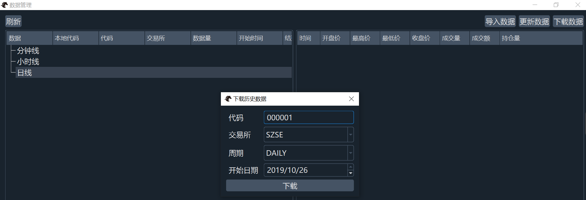

# 06 Learning_notes_上手实操

## 环境

根据前面的md02 md04就知道，我只在windows上可以顺利运行，在Linux上也不知道为什么还报错，所以就用自己电脑操作了。

## VeighNa Trader

### 注册仿真账号

【1】注册SinNow仿真交易账号 以登陆CTP接口

[SimNow网址][https://www.simnow.com.cn/]

【2】[注册教程][https://blog.csdn.net/wqfhenanxc/article/details/119211673]

并不用完全按照注册教程来，就进入上面simnow网址然后点击注册即可

```
注册账号：134********

用户昵称：xxx

investorId：xxxxxx

brokerId：9999

挂靠会员：SimNow
```

### 连接CTP接口

CTP (*Comprehensive Transaction Platform, 综合交易平台*)

API（*Application Programming Interface，应用程序编程接口*）

CTP API是CTP系统提供的编程接口

#### steps

连接的是CTP接口，而不是CTP测试接口。

【测试过了，连CTP测试会一直报错】

其中，各字段填写要求如下：

- 用户名：xxxxxx （6位纯数字账号）
- 密码：xxxxxx （需要修改一次密码用于盘后测试）
- 经纪商代码：9999 （SimNow默认经纪商编号）
- 交易服务器：180.168.146.187:10202 （盘中测试）
- 行情服务器：180.168.146.187:10212 （盘中测试）
- 产品名称：simnow_client_test
- 授权编码：0000000000000000 （16个0）

请注意，用户名需填写InvestorID（6位纯数字），而不是Simnow网站注册时的账号（手机号）。此外，Simnow注册的账号需要修改一次密码后才能登录。

连接成功以后，VeighNa Trader主界面【日志】组件会立刻输出登陆相关信息，同时用户也可以看到账号信息，持仓信息，合约查询等相关信息。如下图所示：


### 合约查询


### 订阅行情

在交易组件输入交易所和合约代码，按回车键即可订阅行情。如订阅股指期货时，交易所填写CFFEX，代码填写对应合约代码IF2306。

订阅成功后，交易组件会显示合约名称，并且在下方显示深度行情报价，如最新价、买一价和卖一价，行情组件会显示最新行情信息，如下图所示：


> 一开始回车在行情那里查不到数据，后面进入合约查询界面查询发现合约代码写错了，官方指南里面写的合约代码是2206，现在是2306

### 委托成交

请注意，若委托类型为市价单，委托价格可不填；若交易接口只支持单向持仓（接口持仓方向支持详见交易接口篇），可不填写开平方向。

发出委托后，本地会缓存委托相关信息，并显示到【委托】组件和【活动】组件，此时委托状态为【提交中】。

交易所收到用户发送的委托后，会将其插入中央订单簿来进行撮合成交，并推送委托回报给用户：

- 若委托还未成交，【委托】组件和【活动】组件只会更新时间和委托状态这两个字段，委托状态变成【未成交】；
- 若委托立刻成交，委托相关信息会从【活动】组件移除，新增至【成交】组件，委托状态变成【全部成交】。

#### 资金组件

需要注意以下三个字段信息：

- 可用资金：可以用于委托的现金
- 冻结：委托操作冻结的金额（与保证金不是一个概念）
- 余额：总资金，即可用资金 + 保证金 + 浮动盈亏

若全部平仓，浮动盈亏变成实际盈亏，保证金和浮动盈亏清零，总资金等于可用资金

#### datafeed数据服务

与数据库适配器类似，对于数据服务有一个标准化的接口BaseDatafeed（位于vnpy.trader.datafeed），实现了更加灵活的数据服务支持，具体字段含义如下：

- datafeed.name: 数据服务接口的名称，全称的小写英文字母；
- datafeed.username: 数据服务的用户名；
- datafeed.password: 数据服务的密码。

目前支持七种datafeed：

- [RQData](https://github.com/vnpy/vnpy_rqdata)
- [Udata](https://github.com/vnpy/vnpy_udata)
- [TuShare](https://github.com/vnpy/vnpy_tushare)
- [TQSDK](https://github.com/vnpy/vnpy_tqsdk)
- [Wind](https://github.com/vnpy/vnpy_wind)
- [iFinD](https://github.com/vnpy/vnpy_ifind)
- [Tinysoft](https://github.com/vnpy/vnpy_tinysoft)

我这里用的是 TuShare，就点入链接进去【https://github.com/vnpy/vnpy_tushare】

【2022-10-27】

后面改成了用 RQData

## 交易接口

### 加载启动

- 加载启动有两种方法
  - VeighNa Station加载
  - 脚本加载

- 如果通过 VeighNa station，点击【交易】按钮，在配置对话框中的【交易接口】栏勾选想要交易的接口。

- 如果通过脚本加载

  以CTP接口为例，在启动脚本中添加如下代码：

  ```python
  # 写在顶部
  from vnpy_ctp import CtpGateway
  
  # 写在创建main_engine对象后
  main_engine.add_gateway(CtpGateway)
  ```

​		

## 数据库

==这部分代码对应 git tag v1.0==

### MySQL

使用的是MySQL

MySQL在VeighNa Trader中配置时，需要填写以下字段信息：

| 字段名            | 值       | 是否必填 |
| :---------------- | :------- | :------- |
| database.name     | "mysql"  | 必填     |
| database.host     | 地址     | 必填     |
| database.port     | 端口     | 必填     |
| database.database | 数据库名 | 必填     |
| database.user     | 用户名   | 可选     |
| database.password | 密码     | 可选     |

MySQL配置示例如下所示：

| 字段名            | 值        |
| :---------------- | :-------- |
| database.name     | mysql     |
| database.host     | localhost |
| database.port     | 3306      |
| database.database | vnpy      |
| database.user     | root      |
| database.password |           |


### MongoDB

MongoDB是一个基于分布式文件储存（bson格式）的非关系型数据库，其特点如下：

- 面向文档存储，操作比较简单；
- 支持丰富的存储类型和数据操作；
- 内置的热数据内存缓存实现更快的读写速度。

**MongoDB配置字段**

MongoDB在VeighNa Trader中配置时，需要填写以下字段信息：

| 字段名                         | 值                                 | 是否必填 |
| :----------------------------- | :--------------------------------- | :------- |
| database.name                  | "mongodb"                          | 必填     |
| database.host                  | 地址                               | 必填     |
| database.port                  | 端口                               | 必填     |
| database.database              | 数据库名                           | 必填     |
| database.user                  | 用户名                             | 可选     |
| database.password              | 密码                               | 可选     |
| database.authentication_source | [创建用户所用的数据库][AuthSource] | 可选     |

MongoDB的带认证配置示例如下所示：

| 字段名                         | 值        |
| :----------------------------- | :-------- |
| database.name                  | mongodb   |
| database.host                  | localhost |
| database.port                  | 27017     |
| database.database              | vnpy      |
| database.user                  | root      |
| database.password              |           |
| database.authentication_source | vnpy      |

【2022-10-26】非关系型数据库我没安装

### 脚本使用数据库

代码路径：`F:\github_data\vnpy\examples\veighna_trader\run.py`

## 数据服务

对于数据服务，VeighNa提供了标准化的接口BaseDatafeed（位于vnpy.trader.datafeed中），实现了更加灵活的数据服务支持。在全局配置中，和数据服务相关的字段都以datafeed作为前缀。

具体字段含义如下：

- datafeed.name：数据服务接口的名称，必须为全称的小写英文字母；
- datafeed.username：数据服务的用户名；
- datafeed.password：数据服务的密码。

以上字段对于所有数据服务都是必填的，如果是token方式授权请填写在datafeed.password字段中。目前VeighNa Trader支持以下七种数据服务，**具体每个数据服务的细节可在对应的项目地址中找到**。

【目前申请的数据服务】

1. TuShare，但是目前只有170积分，只能获得股票日线数据
2. RQData，目前【2022-10-27】申请了高校学生服务，还没审批通过，不知道能不能用呢--->【可以使用了】

### TuShare

**我使用的是TuShare。因为他是开源的hhh。**

> Ref操作手册：https://www.tushare.pro/document/1?doc_id=37

TuShare是国内知名的开源Python金融数据接口项目，由大神Jimmy团队长期开发维护，除了行情数据外还提供许多另类数据：

- 项目地址：[vnpy_tushare](https://www.github.com/vnpy/vnpy_tushare)
- 数据分类：股票、期货
- 数据周期：日线、分钟线（盘后更新）
- 注册申请：[Tushare大数据社区](https://tushare.pro/)

在VeighNa中使用TuShare时，需要在全局配置中填写以下字段信息：

| 名称              | 含义   | 必填 | 举例                                             |
| ----------------- | ------ | ---- | ------------------------------------------------ |
| datafeed.name     | 名称   | 是   | tushare                                          |
| datafeed.username | 用户名 | 否   | token                                            |
| datafeed.password | 密码   | 是   | pwd                                              |

注册完之后，把自己的pwd设置好，原本为空，输入完变成下面：


### 脚本编辑配置

这部分是我自己看代码改的，也不确定对不对，就先试一试。

代码修改路径：`F:\github_data\vnpy\vnpy\trader\setting.py`

修改的代码：


```python
# "datafeed.name": "",
    # "datafeed.username": "",
    # "datafeed.password": "",
    "datafeed.name": "tushare",
    "datafeed.username": "token",
    "datafeed.password": "pwd",

    "database.timezone": get_localzone_name(),
    # "database.name": "sqlite",
    # "database.database": "database.db",
    # "database.host": "",
    # "database.port": 0,
    # "database.user": "",
    # "database.password": ""
    "database.name": "mysql",
    "database.database": "vnpy",
    "database.host": "localhost",
    "database.port": 3306,
    "database.user": "root",
    "database.password": "pwd"
```


我也不知道改了有没有用，反正改完没报错，也有可能是因为本身在GUI改了保存到


所以上面代码改了之后，可能也没太大用 hh

### 脚本加载数据

==这部分代码对应 git tag v1.1==

想通过TuShare获取数据，结果积分不够，没有权限……


拿到170积分之后，发现也只能有获取股票日线数据的权限，没有期货的权限。下面展示的是如果用GUI下载历史数据并保存到数据库中：




然后尝试对代码进行更改，终于成功了，修改的代码在`v1.1`里面

```
"datafeed.name": "rqdata",
    "datafeed.username": "license",
    "datafeed.password": "pwd",
```


## CtaStrategy

### 功能介绍

CtaStrategy是用于**CTA自动交易**的功能模块，用户可以通过其UI界面操作来便捷完成策略初始化、策略启动、策略停止、策略参数编辑以及策略移除等任务

### 加载启动

加载启动有2种方式：GUI加载和脚本加载

#### GUI加载

启动登录VeighNa Station后，点击【交易】按钮，在配置对话框中的【应用模块】栏勾选【CtaStrategy】


#### 脚本加载

在启动脚本中添加如下代码：

```python
# 写在顶部
from vnpy_ctastrategy import CtaStrategyApp

# 写在创建main_engine对象后
main_engine.add_app(CtaStrategyApp)
```

### 启动模块

对于用户自行开发的策略，需要放到VeighNa Trader运行时目录下的**strategies**目录中，才能被识别加载。具体的运行时目录路径，可以在VeighNa Trader主界面顶部的标题栏查看。

对于在Windows上默认安装的用户来说，放置策略的strategies目录路径通常为：

```
C:\Users\Administrator\strategies
```

其中Administrator为当前登录Windows的系统用户名。

在启动模块之前，请先连接交易接口（连接方法详见基本使用篇的连接接口部分）。看到VeighNa Trader主界面【日志】栏输出“合约信息查询成功”之后再启动模块，成功连接交易接口后，在菜单栏中点击【功能】-> 【CTA策略】


### 添加策略

用户可以基于编写好的CTA策略模板（类）来创建不同的策略实例（对象）。策略实例的好处在于，同一个策略可以同时去交易多个品种合约，并且每个实例的参数可以是不同的。

请注意，显示的策略名称是**策略类**（驼峰式命名）的名字，而不是策略文件（下划线模式命名）的名字。

选择好策略类之后，点击【添加策略】，会弹出添加策略对话框，如下图所示：


在创建策略实例时，需要配置相关参数，各参数要求如下：

- 实例名称
  - 实例名称不能重名；
  - 这里以 atr01
- 合约品种
  - 格式为vt_symbol（合约代码 + 交易所名称）；
  - 一定要是实盘交易系统中可以查到的合约名称；
  - 一般选择该期货品种当前流动性最好的月份；
  - 这里以 CFFEX 的股指2306 为例，查到的`vt_symbol`为`IF2306.CFFEX`
- 参数设置
  - 这里不知道怎么设置就先用默认参数
  - 显示的参数名是策略里写在parameters列表中的参数名；
  - 默认数值为策略里的参数的默认值；
  - 由上图可观察到，参数名后面<>括号中显示的是该参数的数据类型，在填写参数时应遵循相应的数据类型。其中，<class ‘str’>是字符串、<class ‘int’>是整数、<class ‘float’>是浮点数；
  - 请注意，如果某个参数可能会调整至有小数位的数值，而默认参数值是整数（比如1）。请在编写策略时，把默认参数值设为浮点数（比如1.0）。否则策略会默认该项参数为整数，在后续【编辑】策略实例参数时，会只允许填进整数。

参数配置完成后，点击【添加】按钮，则开始创建策略实例。创建成功后可在左侧的策略监控组件中看到该策略实例，如下图所示：


策略监控组件顶部显示的是策略实例名、合约品种名、策略类名以及策略作者名（在策略里定义的author）。顶部按钮用于控制和管理策略实例，第一行表格显示了策略内部的参数信息（参数名需要写在策略的parameters列表中图形界面才会显示），第二行表格则显示了策略运行过程中的变量信息（变量名需要写在策略的variables列表中图形界面才会显示）。

【inited】字段表示当前策略的初始化状态（是否已经完成了历史数据回放）

【trading】字段表示策略当前是否能够开始交易。

从上图可观察到，此时该策略实例的【inited】和【trading】状态都为【False】。说明该策略实例还没有初始化，也还不能发出交易信号。

策略实例创建成功后，该策略实例的配置信息会被保存到.vntrader文件夹下的cta_strategy_setting.json文件中。

### 管理策略

#### 初始化

初始化过程中，主要按顺序完成了以下三步任务：

1. 获取历史数据

   为了确保策略内指标数值的准确性，每个策略实例都需要一定的历史数据来进行策略初始化。

   因此，在策略初始化时，策略实例内部的load_bar函数会先去接口获取最新历史数据。**如果接口不提供历史数据，则通过配置的数据服务获取**（以RQData为例，[RQData](https://www.ricequant.com/welcome/purchase?utm_source=vnpy)提供国内期货、股票以及期权的历史数据。RQData的数据服务提供盘中K线更新，即使在9点45分才启动策略，也能获取到之前从9点30开盘到9点45分之间的K线数据，提供给策略进行初始化计算，而不用担心数据缺失的问题）。如果没有配置数据服务，则通过访问本地数据库查询。这种情况下，用户需要保证数据库中的数据完整性（满足初始化需求），可以通过DataRecorder录制，或者使用DataManager从CSV文件导入。

   【simnow提供的是行情数据。
   ctp接口不提供历史数据，点击下载是去rqdata下了，如果没有rqdata账号，可以申请试用或者用datamanager导入本地数据进行回测[答案链接][https://www.vnpy.com/forum/topic/5440-ctplian-jie-zheng-chang-wu-fa-huo-qu-simnowde-li-shi-shu-ju-zen-yao-ni]】

   【通过米筐开给vn.py用户的专属链接申请试用，不需要名片：

   https://www.ricequant.com/welcome/purchase?utm_source=vnpy】

   具体载入数据的长度，取决于load_bar函数的参数控制（策略模板默认是10天）。数据载入后会以逐根K线（或者Tick）的方式推送给策略，实现内部变量的初始化计算，比如缓存K线序列、计算技术指标等。

2. 载入缓存变量

   在每天实盘运行的过程中，量化策略中的有些变量只和历史行情数据相关，这类变量通过加载历史数据回放就能得到正确的数值。另一类变量则可能和交易状态相关，如策略的持仓、移动止损的最高价跟踪等，这类变量需要缓存在硬盘上（退出程序时），第二天回放完历史数据后再读取还原，才能保证和之前交易状态的一致性。

   每次停止策略时，会自动将策略的variables列表对应的变量以及策略持仓缓存进.vntrader目录下的cta_strategy_data.json文件中，以便在下一次策略初始化时自动载入。

   请注意，在某些情况下（比如手动平仓了），缓存的数据可能会出现偏差（因为策略持仓维护的是运行策略实例的逻辑持仓，不是特定品种的持仓），那么可以通过手动修改json文件来调整。

3. 订阅行情推送

   最后基于vt_symbol参数获取该策略所交易合约的信息，并订阅该合约的实时行情推送。如果实盘交易系统找不到该合约的信息，比如没有连接登录接口或者vt_symbol填写错误，则会在日志模块中输出相应的报错信息。

以上三个步骤完成后，可观察到此时该策略实例的【inited】状态已经为【True】，且变量也都显示对应的数值（不再为0）。说明该策略实例已经调用过load_bar函数加载历史数据并完成初始化了。【trading】状态还是为【False】，说明此时该策略实例还不能开始自动交易。


由图可知：如果策略逻辑是基于示例策略中的，一但ArrayManager没有初始化成功(if not am.inited)就返回了逻辑写的话，那么由下图可观察到，图形界面左侧的策略实例中基于**ArrayManager计算的策略指标的值都是0**。说明此时该策略实例虽然启动之后就可以开始自动交易了，但是因为ArrayManager没有初始化成功，策略内的逻辑每次走到ArrayManager初始化状态判断时就返回了，走不到计算指标进而发出交易信号的逻辑。进而该策略实例需要一直等到推进策略实例的数据足够ArrayManager初始化之后，满足ArrayManager初始化的判断条件，才能真正发出交易信号。

【后面改成用rqdata连接之后就成功了！，见下图】


#### 启动

策略实例初始化成功，【inited】状态为【True】时，才能启动自动交易功能。点击策略实例下的【启动】按钮，即可启动该策略实例。

#### 停止

如果启动策略之后，由于某些情况（如到了市场收盘时间，或盘中遇到紧急情况）想要停止、编辑或者移除策略，可以点击策略实例下的【停止】按钮，即可停止该策略实例的自动交易。

CTA策略引擎会自动将该策略之前发出的所有活动委托全部撤销，以保证在策略停止后不会有失去控制的委托存在。同时该策略实例最新的变量信息会被保存到.vntrader文件夹下的cta_strategy_data.json文件中。

此时可观察到该策略实例的【trading】状态已变为【False】，说明此时该策略实例已经停止自动交易了。

在CTA策略的实盘交易过程中，正常情况应该让策略在整个交易时段中都自动运行，尽量不要有额外的暂停重启类操作。对于国内期货市场来说，应该在交易时段开始前，启动策略的自动交易，然后直到收盘后，再关闭自动交易。因为现在CTP夜盘收盘后也会关闭系统，早上开盘前重启，所以夜盘收盘后也需要停止策略，关闭VeighNa Trader了。

#### 编辑

如果创建策略实例之后，想要编辑某个策略实例的参数（若已启动策略，需要先点击策略实例下的【停止】按钮，停止策略），可以点击该策略实例下的【编辑】按钮，会弹出参数编辑对话框，以供修改策略参数。

但是策略实例的交易合约代码无法修改，同时修改完后也不会重新执行初始化操作。也请注意，此时修改的只是.vntrader文件夹下cta_strategy_setting.json文件中该策略实例的参数值，并没有修改原策略文件下的参数。

若盘中编辑后想要再次启动策略，点击策略实例下的【启动】按钮即可再次启动该策略实例

**此时.vntrader文件夹下的cta_strategy_setting.json文件也移除了该策略实例的配置信息。**

### 状态跟踪

【这个大概率是自己手写策略的时候会用到，现在还没仔细看 @2022-10-27】

如果想要通过图形界面跟踪策略的状态，有两种方式：

1. 调用put_event函数

   策略实例中所有的的变量信息，都需要把变量名写在策略的variables列表中，才能在图形界面显示。如果想跟踪变量的状态变化，则需要在策略中调用put_event函数，界面上才会进行数据刷新。

   有时用户会发现自己写的策略无论跑多久，变量信息都不发生变化，这种情况请检查策略中是否漏掉了对put_event函数的调用。

2. 调用write_log函数

   如果不仅想观察到变量信息的状态变化，还想根据策略的状态输出基于自己需求的个性化的日志，可以在策略中调用write_log函数，进行日志输出。

### 日志

如果在策略中**调用了write_log函数**，那么日志内容就会通过策略日志输出。下图红框里的内容分别是两个不同的策略实例输出的策略日志。中括号里是策略实例的名称，中括号后是write_log函数输出的内容。

【这样看来，如果自己写的策略如果要有日志输出，就要调用这个函数】


### 停止单

停止单监控组件：是用来跟踪所有CTA引擎内本地停止单的状态变化的，如下图所示。


因为不是所有接口都支持停止单，所以VeighNa提供了本地停止单的功能。在交易接口不支持交易所停止单的前提下，用户依然可以通过策略的下单函数（buy/sell/short/cover），把stop参数设置为True，启用本地停止单功能。

VeighNa的本地停止单有三个特点：

1. 保存在本地电脑上，关机后则失效；
2. 只有交易员本人能够看到，不必担心泄露底牌；
3. 停止单触发有延时，导致一定的滑点。

- 停止单有3种状态：【等待中】、【已触发】和【已撤销】
  - 停止单刚发出时是处于【等待中】的状态。因为停止单的信息记录在本地，没有发往交易所，所以此时主界面上【委托】栏不会有变化。
  - 一旦该停止单的委托价格被触发，为了实现立即成交的目的，CTA策略引擎会立即以**涨跌停价**或者**盘口五档**的价格，去发出**限价**委托（所以建议本地停止单只用于流动性较好的合约）。限价委托发出后，VeighNa Trader主界面上【委托】栏将更新该订单的状态，此时停止单状态会变为【已触发】，【限价委托号】栏下也会填入该订单的限价委托号。
  - 请注意，**停止单界面显示的价格是本地停止单的触发价格，而不是发出限价单的价格**。
  - 如果停止单在被触发前就被策略取消了，那么该订单的状态就会变为【已撤销】。

### 移仓助手

首先请在在左侧区域配置要执行的移仓任务，其中：


- 移仓合约：该下拉框中，显示当前CTA策略模块下所有策略实例所交易的合约本地代码，选择要平仓掉的老合约；
- 目标合约：要将老的仓位和策略，移仓过去的的合约本地代码（vt_symbol），输入要开仓的新合约；
- 委托超价：执行移仓交易时，委托价格相对于当时盘口对价超出的pricetick。

移仓过程中具体执行的任务步骤如下：

- 仓位移仓：
  - 对当前账户内，移仓合约的【所有仓位】进行平仓（注意这里不会区分策略持仓还是手动交易持仓），并记录对应的仓位（多空分别记录）；
  - 对目标合约执行开仓交易，开仓的价格为当时的盘口对价加上超价pricetick，数量为上一步中记录的原有移仓合约持仓量。
- 策略移仓：
  - 记录当前CTA策略模块中，所有交易对象为移仓合约的策略的【逻辑持仓】（注意这里的逻辑持仓和账户实际持仓不一定完全对应）；
  - 将上述交易对象为移仓合约的老策略实例删除，并创建以目标合约为交易标的同名新策略实例；
  - 初始化新策略实例，并将之前记录的老策略实例的【逻辑持仓】，更新到新策略的状态上。

### CtaTemplate

==这部分很重要，结合【代码】，【官方对应文档】，【我自己的md笔记】一起看！==

==这部分代码对应 git tag v1.2==

TA策略模板提供了信号生成和委托管理功能，用户可以基于该模板(位于site-packages\vnpy_ctastrategy\template中)自行开发CTA策略。

用户自行开发的策略可以放在用户运行文件夹下的[strategies] 文件夹内。

> 对于在Windows上默认安装的用户来说，放置策略的strategies目录路径通常为：
>
> ```
> C:\Users\Administrator\strategies
> ```
>
> 其中Administrator为当前登录Windows的系统用户名。

请注意：

1. 策略文件命名采用**下划线**模式，如boll_channel_strategy.py，而策略类命名采用**驼峰式**，如BollChannelStrategy。
2. 自建策略的类名不要与示例策略的类名重合。如果重合了，图形界面上只会显示一个策略类名。


请注意，国内期货有开平仓的概念，例如买入操作要区分为买入开仓和买入平仓；但对于股票、外盘期货都是净持仓模式，没有开仓和平仓概念，所以只需使用买入（buy）和卖出（sell）这两个指令就可以了。


## CtaBacktester

### 功能介绍

CtaBacktester是用于**CTA回测研究**的功能模块，用户可以通过其UI界面操作来便捷完成数据下载、历史回测、结果分析和参数优化等任务。

### 加载启动

提供两种启动方式：App加载和脚本加载

#### VeighNa Station加载

启动登录VeighNa Station后，点击【交易】按钮，在配置对话框中的【应用模块】栏勾选【CtaBacktester】

#### 脚本加载

在启动脚本中添加如下代码：

```
# 写在顶部
from vnpy_ctabacktester import CtaBacktesterApp

# 写在创建main_engine对象后
main_engine.add_app(CtaBacktesterApp)
```

### 启动模块

对于前面写的`F:\github_data\vnpy_self\vnpy\strategies\boll_channel_strategy_v1.py`放在VeighNa Trader运行时目录下的**strategies**目录中，再启动Cta回测，就可以看见了！


### 下载数据

下载数据需要填写本地代码、K线周期、开始日期以及结束日期四个字段信息：

- 本地代码
  - 格式为合约代码 + 交易所名称
  - 如IF888.CFFEX、rb2105.SHFE
- K线周期：
  - 1m（1分钟K线）
  - 1h（1小时K线）
  - d（日K线）
  - w（周K线）
  - tick（一个Tick）
- 开始和结束日期
  - 格式为yyyy/mm/dd
  - 如2018/2/25、2021/2/28

填写完成后，点击下方【下载数据】按钮启动下载任务，成功后如下图所示：


注意下载完成后的历史数据会保存在本地数据库中，后续回测时可以直接使用，无需每次都重复下载。


### 执行回测

准备好数据后即可开始使用历史数据对策略进行回测研究，回测时需要配置好相关的参数：

- 策略品种
  - 交易策略：在下拉框中选择要回测的策略名称；
  - 本地代码：注意不要漏掉交易所后缀；
- 数据范围
  - 格式详见本章[下载数据](https://www.vnpy.com/docs/cn/cta_backtester.html#jump)部分的介绍；
- 交易成本
  - 滑点：下单交易点位与实际交易点位的差别；
  - 百分比手续费：填写数字即可，不要填写百分数；
  - 固定比手续费：可以手续费填0，然后把手续费除以合约乘数后，加在滑点中；
- 合约属性
  - 合约乘数：合约的交易单位；
  - 价格跳动：合约价格的最小变动价位；
  - 回测资金：账户资金；
  - 合约模式：正向。

配置完成后，点击下方的【开始回测】按钮，会弹出策略参数配置对话框，用于设置策略参数，如下图所示


回测完成后，会自动在右侧区域显示策略回测业绩的统计指标以及相关图表，如下图所示：


### 结果分析

> Ref: https://blog.csdn.net/IAlexanderI/article/details/81566021?spm

| 字段           | 说明                                                         |
| :------------- | :----------------------------------------------------------- |
| 第一笔交易     | 第一笔交易的平仓时间                                         |
| 最后一笔交易   | 最后一笔交易的平仓时间                                       |
| 总交易次数     | 整个回测的总交易次数                                         |
| 总盈亏         | 整个回测的总盈亏，由于回测时初始资金为0，总盈亏其实就是当前资金 |
| 最大回撤       | 每次交易后的回撤 = 每笔交易后的资金 - 回测中最大资金。由于回撤为非正值，所以最大回撤为所有交易后的回撤绝对值最大的 |
| 平均每笔盈利   | 总盈亏/总交易次数                                            |
| 平均每笔滑点   | 总滑点成本/总交易次数                                        |
| 平均每笔佣金   | 总佣金成本/总交易次数                                        |
| 胜率           | 盈利交易次数/总交易次数*100(%)                               |
| 盈利交易平均值 | 总盈利交易的盈利/总盈利交易次数                              |
| 亏损交易平均值 | 总亏损交易的盈利/总亏损交易次数                              |
| 盈亏比         | 盈利交易平均值/亏损交易平均值                                |

- 【账户净值】图的横轴是时间，纵轴是资金，体现了账户净值在交易时段内随着交易日变化的情况。
- 【净值回撤】图的横轴是时间，纵轴是回撤，体现了净值从最近高点回撤程度随着交易日变化的情况。
- 【每日盈亏】图的横轴是时间，纵轴是日盈亏的金额（采用逐日盯市规则以收盘价结算），体现了整个回测周期内策略的每日盈亏变化情况
- 【盈亏分布】图的横轴是每日盈亏的数值，纵轴是该盈亏数值的出现概率，体现了整体每日盈亏的概率分布情况。

需要分析的模块：


- 回测过程中策略发出委托的**成交价**不一定是原始下单的价格，而要由回测引擎基于当时的行情数据和下单价格进行撮合后算出，每笔委托对应的具体成交细节可以点击【成交记录】按钮后查看
- 每日盈亏
  - 每日盈亏的统计采用期货市场普遍使用的逐日盯市（Marking-to-Market）规则进行计算：
    - 持仓盈亏：今日开盘持仓的部分，以昨收盘价开仓，今收盘价平仓，计算出的盈亏金额；
    - 交易盈亏：今日日内成交的部分，以成交价格开仓，今收盘价平仓，计算出的盈亏金额；
    - 总盈亏：汇总持仓盈亏和交易盈亏后的金额；
    - 净盈亏：总盈亏扣除手续费和滑点后的金额，也是最终计算显示四张图表时用到的每日盈亏金额

### 参数优化

对于开发好的策略，可以使用CtaBacktester内置的优化算法快速进行参数寻优，目前支持穷举和遗传两种优化算法。

#### 设置优化参数

点击【参数优化】按钮，会弹出“优化参数配置”的窗口：

对于要进行优化的策略参数，需要配置：

- 【开始】和【结束】：用于给定参数优化的范围；
- 【步进】：用于给定参数每次变化的数值；

举例：如一个参数的【开始】设为10，【结束】设为20，【步进】设为2，则该参数在优化过程中的寻优空间为：10、12、14、16、18、20。


对于要设置固定数值的策略参数，请将【开始】和【结束】都同样设为该数值即可。

hmm，总收益率没变化：


#### 穷举算法优化

设置好需要优化的参数后，点击窗口底部的【多进程优化】按钮，此时CtaBacktester会调用Python的multiprocessing模块，根据当前电脑CPU的核心数量，启动对应数量的进程来并行执行穷举优化任务。

在优化的过程中，穷举算法会遍历参数寻优空间中的每一个组合。遍历的过程即使用该组合作为策略参数运行一次历史回测，并返回优化目标函数的数值。完成遍历后，根据所有目标函数的数值进行排序，从而选出最优的参数组合结果。

穷举算法优化的效率和CPU核心数量直接相关：若用户计算机是2核，则优化时间为单核的1/2；若计算机是10核，则优化时间会大幅降低到单核的1/10。

#### 遗传算法优化

设置好需要优化的参数后，点击窗口底部的【遗传算法优化】按钮，此时CtaBacktester会调用Python的multiprocessing模块和deap模块，来执行高效智能化的多进程遗传算法优化任务。

附上遗传算法的简要工作原理：

1. 定义优化方向，如总收益率最大化；
2. 随机从全局寻优空间中，选择出部分参数组合形成初始族群；
3. 对族群内所有个体进行评估，即运行回测获取目标函数结果；
4. 基于目标函数结果进行排序，剔除表现不好的个体（参数组合）；
5. 对剩下的个体进行交叉或者变异，通过评估和筛选后形成新的族群；
6. 以上3-5步为一次完整的种群迭代，在整个优化过程中需要多次重复；
7. 多次迭代后，种群内差异性减少，参数收敛向最优解，最终输出结果。

### 策略代码

想让修改内容在内存中立即生效，需要点击左下角的【策略重载】按钮，此时CtaBacktester会自动扫描并重新加载所有策略文件中的策略代码，同时会有相关日志输出

## bugs

### Problem1 CTP连接错误


>  可能是因为不在交易时间，所以连接不上
>
> 不是，发现交易时间也连不上，后面发现是【Simnow注册的账号需要修改一次密码后才能登录】

Solution：修改密码，然后用修改后的密码登陆


### Problem2 运行目录

想要修改运行目录，在`F:\github_data\vnpy_self\vnpy\trader\utility.py`修改了`_get_trader_dir`,但是在`F:\github_data\vnpy_self\examples\veighna_trader\run.py`中一直显示的`from vnpy.trader.utility import TRADER_DIR`路径还是`C:\Users\MagicKD`

搜到的一个原因：【但是还没能解决】

> https://www.vnpy.com/forum/topic/29789-yong-no-uide-fang-shi-zai-run-pyshe-zhi-ce-lue-jia-zai-lu-jing
>
> 

## Knowledge

[CTP程序化交易入门系列之一：准备 - 知乎专栏](https://zhuanlan.zhihu.com/p/80709410)

